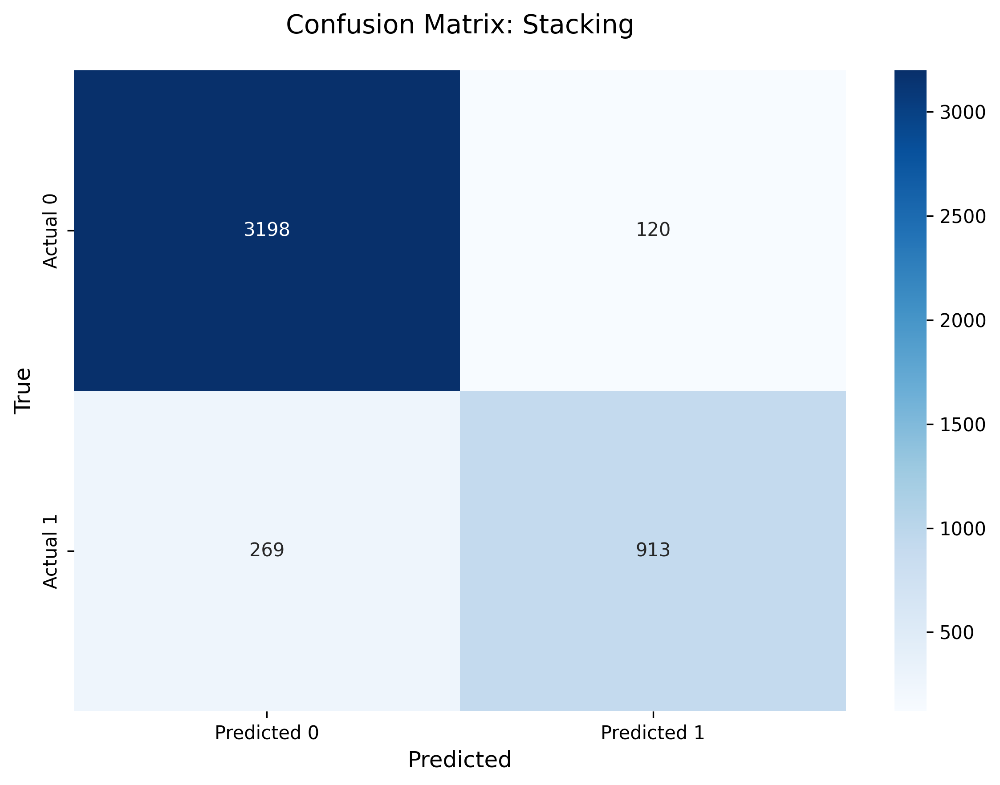
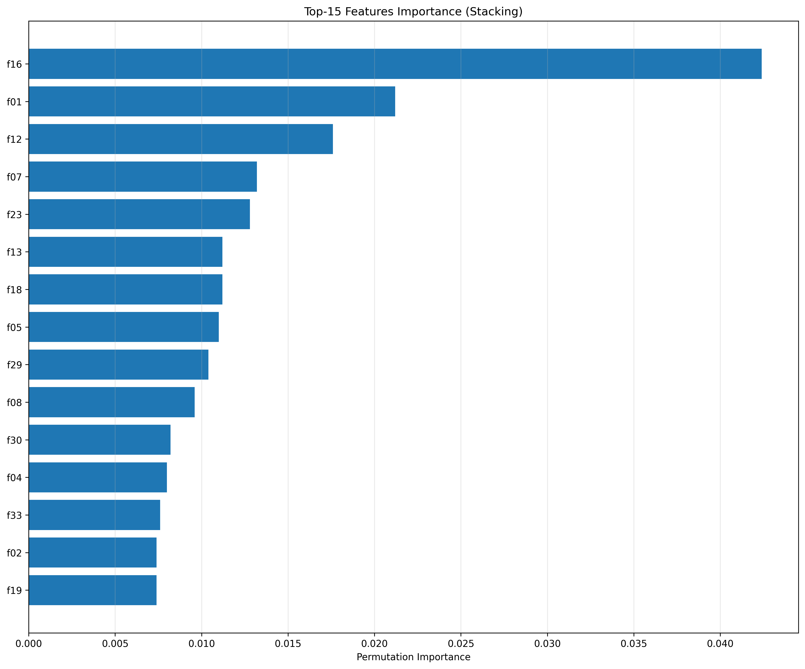

## 1. Dataset

- Какой датасет выбран: `S06-hw-dataset-02.csv`
- Размер: (17999, 39)
- Целевая переменная: `target` (0 = 73.738889%, 1 = 26.261111%)
- Признаки: Всего признаков: 37, 
            Числовых признаков: 37

## 2. Protocol 

- Разбиение: 
    Размер train: (13500, 37)
    Размер test: (4500, 37)
    random_state: 42 (для воспроизводимости)
    Стратификация: Есть (сохранение распределения классов в train/test)

- Подбор: Использовано CCP, в котором, внутренне, реализован подбор гиперпараметров для Дерева решений
- Метрики: 
    Accuracy: общая точность классификации
    F1-score: гармоническое среднее precision и recall
    Precision: для сбора дополнительных метрик о точности
    Recall: как дополнительная метрика
    ROC-AUC: площадь под ROC-кривой

## 3. Models

Опишите, какие модели сравнивали и какие гиперпараметры подбирали.

Минимум:

- DummyClassifier (baseline)

    Использовал стратегию stratified, для предсказания в соответствия с распределением классов

- LogisticRegression (baseline из S05)

    Pipeline: StandardScaler + LogisticRegression
    max_iter: 4000
    random_state: 42

- DecisionTreeClassifier (контроль сложности: `max_depth` + `min_samples_leaf` или `ccp_alpha`)

    Подбираемым параметром взял ccp_alpha

- RandomForestClassifier

    Не использовал гиперпараметров, ограничил с помощью max_features=10

- Один boosting (AdaBoost / GradientBoosting / HistGradientBoosting)

    Использовал AdaBoost: 
        estimator=stump, 
        n_estimators=500,
        learning_rate=0.6,
        random_state=42

Опционально:

- StackingClassifier (с CV-логикой)

    Базовыми моделями взял: `Logstic Regression` (max_iter=2000), 
    `Random Forest` (n_estimators=250, random_state=42, n_jobs=-1), 
    `Gradient Boost` (n_estimators=250, learning_rate=0.05, max_depth=2, random_state=RANDOM_STATE)

    Мета-модель: `Logistic Regression`

    CV в стеккинге: 5 фолдов

## 4. Results

- Таблица/список финальных метрик на test по всем моделям

                     accuracy  precision    recall  F1 score   roc_auc
Dummy Stratified     0.618000   0.267532  0.261421  0.264442  0.503224
Logistic Regression  0.816222   0.736983  0.467005  0.571724  0.800890
Decision Tree        0.846222   0.747475  0.626058  0.681400  0.815035
Random Forest        0.896889   0.917442  0.667513  0.772772  0.928401
Stacking             0.913556   0.883833  0.772420  0.824379  0.932545

- Победитель (по ROC-AUC или по согласованному критерию) и краткое объяснение

Победителем стал `Stacking` по roc_auc и accuracy

## 5. Analysis

- Устойчивость: что будет, если поменять `random_state` (хотя бы 5 прогонов для 1-2 моделей) – кратко

+ Проверил для Random Forest, после изменения RANDOM_STATE, метрики меняются на (+- 0.002 в случае accuracy) 

- Ошибки: confusion matrix для лучшей модели + комментарий

    

### Комментарий: 
+ Правильно классифицировано: 4111 из 4500 (91.3%)
+ Основные ошибки: 389 неправильных предсказаний

- Интерпретация: permutation importance (top-10/15) + выводы

### Permutation Importance для Random Forest:

15 важных признаков:

   feature  importance_mean  importance_std
15     f16           0.0424        0.005886
0      f01           0.0212        0.002135
11     f12           0.0176        0.003200
6      f07           0.0132        0.005115
22     f23           0.0128        0.002482
12     f13           0.0112        0.002786
17     f18           0.0112        0.001166
4      f05           0.0110        0.002608
28     f29           0.0104        0.001356
7      f08           0.0096        0.001020
29     f30           0.0082        0.003655
3      f04           0.0080        0.003795
32     f33           0.0076        0.001497
1      f02           0.0074        0.002728
18     f19           0.0074        0.003137

### Выводы

+ Самыми важными признаками стали f16, f01, f12, их средняя важность составила 0.0424, 0.0212 и 0.176 соотвественно. 
+ Разница между f16 и f01 равно в два раза
+ Распределение важности почти равномерное - есть один признак которые явно доминируют

## 6. Conclusion

1. **Ансамблевые методы обходят одиночные модели:** Stacking и Random Forest показали результат лучше чем Decision Tree и Logistic Regression (более чем на 10%)
2. **Контроль сложности имеет непосредственную важность:** Для DecisionTree использование CCP позволило избежать переобучение и вследствии отсутствие "гибкости"
3. **Протокол ML-экспиримента важен:** Использование фиксированного random_state помогает воспроизводить *фиксированные* результаты